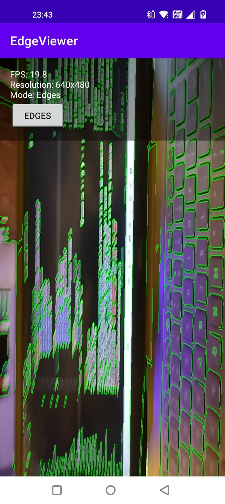
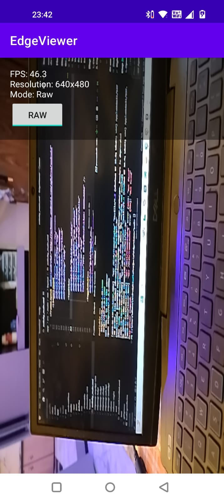

# EdgeViewer - Real-Time Edge Detection Viewer

An Android application that captures camera frames, processes them using OpenCV (C++) via JNI, and renders the results using OpenGL ES. Includes a TypeScript web viewer for debugging and demonstration.

## ✅ Features Implemented

### Android Application
- ✅ **Camera Feed Integration**: Uses CameraX with `ImageAnalysis` to capture frames
- ✅ **Frame Processing via OpenCV (C++)**: JNI bridge sends RGBA frames to native code for Canny edge detection
- ✅ **OpenGL ES Rendering**: Real-time display of processed frames at 10-15+ FPS
- ✅ **Toggle Between Modes**: Switch between raw camera feed and edge-detected output
- ✅ **FPS Counter**: Real-time frame rate and resolution statistics
- ✅ **Configurable Edge Detection**: Adjustable thresholds, blur, and histogram equalization

### Web Viewer (TypeScript)
- ✅ **Frame Display**: Shows processed frames (static image or base64)
- ✅ **Frame Statistics**: Displays FPS, resolution, mode, and timestamp
- ✅ **Modular Architecture**: Clean TypeScript project structure with separate modules
- ✅ **Mock Frame Stream**: Demonstrates real-time frame updates

## 📸 Screenshots

### Android App

| Edge Detection Mode | Raw Camera Mode |
|---------------------|-----------------|
|  |  |

## ⚙️ Setup Instructions

### Prerequisites

1. **Android Studio** (latest version)
2. **Android NDK** (installed via Android Studio SDK Manager)
3. **OpenCV for Android**:
   - Download OpenCV Android SDK from [opencv.org](https://opencv.org/android/)
   - Extract and copy the `libs` folder contents to `app/src/main/jniLibs/`
   - Copy the `include` folder to `app/src/main/cpp/include/`
4. **Node.js and npm** (for web viewer)

### Android Setup

1. **Clone the repository**:
   ```bash
   git clone https://github.com/Dhawalgit09/EDGEVIEWER.git
   cd EDGEVIEWER
   ```

2. **Open in Android Studio**:
   - Open Android Studio
   - Select "Open an Existing Project"
   - Navigate to the project directory

3. **Configure OpenCV**:
   - Download OpenCV Android SDK from [opencv.org](https://opencv.org/android/) and extract it
   - Copy OpenCV native libraries to `app/src/main/jniLibs/` for all ABIs:
     - From `OpenCV-android-sdk/sdk/native/libs/arm64-v8a/` copy:
       - `libopencv_java4.so`
       - `libc++_shared.so` ⚠️ **REQUIRED** - OpenCV depends on this
     - From `OpenCV-android-sdk/sdk/native/libs/armeabi-v7a/` copy:
       - `libopencv_java4.so`
       - `libc++_shared.so`
     - From `OpenCV-android-sdk/sdk/native/libs/x86/` copy:
       - `libopencv_java4.so`
       - `libc++_shared.so`
     - From `OpenCV-android-sdk/sdk/native/libs/x86_64/` copy:
       - `libopencv_java4.so`
       - `libc++_shared.so`
   - Copy OpenCV headers: From `OpenCV-android-sdk/sdk/native/jni/include/` to `app/src/main/cpp/include/`
   
   **Final structure should be:**
   ```
   app/src/main/
   ├── jniLibs/
   │   ├── arm64-v8a/
   │   │   ├── libopencv_java4.so
   │   │   └── libc++_shared.so
   │   ├── armeabi-v7a/
   │   │   ├── libopencv_java4.so
   │   │   └── libc++_shared.so
   │   ├── x86/
   │   │   ├── libopencv_java4.so
   │   │   └── libc++_shared.so
   │   └── x86_64/
   │       ├── libopencv_java4.so
   │       └── libc++_shared.so
   └── cpp/
       └── include/
           └── opencv2/
               └── ...
   ```

4. **Sync Gradle**:
   - Click "Sync Project with Gradle Files" in Android Studio
   - Wait for dependencies to download

5. **Build and Run**:
   - Connect an Android device or start an emulator
   - Click "Run" or press `Shift+F10`
   - Grant camera permission when prompted

### Web Viewer Setup

1. **Navigate to web directory**:
   ```bash
   cd web
   ```

2. **Install dependencies**:
   ```bash
   npm install
   ```

3. **Build TypeScript**:
   ```bash
   npm run build
   ```

4. **Serve the application**:
   ```bash
   npm run serve
   ```

5. **Open in browser**:
   - Navigate to `http://localhost:8080`

## 🧠 Architecture Overview

### Frame Flow

```
Camera (CameraX)
    ↓
ImageAnalysis → YUV_420_888 frames
    ↓
YuvToRgbaConverter → RGBA ByteArray
    ↓
JNI Bridge (NativeProcessor.kt)
    ↓
Native C++ (native-lib.cpp)
    ↓
OpenCV Processing:
  - Convert to grayscale
  - Optional: Histogram equalization
  - Optional: Gaussian blur
  - Canny edge detection
  - Overlay edges on original frame
    ↓
Return processed RGBA ByteArray
    ↓
OpenGL Renderer (EdgeRenderer.kt)
    ↓
Display on GLSurfaceView
```

### Project Structure

```
EdgeViewer/
├── app/
│   ├── src/main/
│   │   ├── java/com/example/edgeviewer/
│   │   │   ├── MainActivity.kt              # Main activity, UI coordination
│   │   │   ├── camera/
│   │   │   │   ├── CameraController.kt      # CameraX setup and binding
│   │   │   │   ├── FrameAnalyzer.kt         # ImageAnalysis.Analyzer implementation
│   │   │   │   └── YuvToRgbaConverter.kt   # YUV to RGBA conversion
│   │   │   ├── gl/
│   │   │   │   ├── EdgeSurfaceView.kt       # Custom GLSurfaceView
│   │   │   │   └── EdgeRenderer.kt         # OpenGL ES renderer
│   │   │   └── nativeproc/
│   │   │       └── NativeProcessor.kt      # JNI wrapper
│   │   ├── cpp/
│   │   │   ├── native-lib.cpp               # OpenCV processing (C++)
│   │   │   ├── CMakeLists.txt               # CMake build configuration
│   │   │   └── include/                     # OpenCV headers
│   │   └── jniLibs/                         # OpenCV native libraries
│   └── build.gradle.kts                     # App dependencies
├── web/                                      # TypeScript web viewer
│   ├── src/
│   │   ├── main.ts                          # Application entry point
│   │   ├── frameDisplay.ts                  # Canvas rendering
│   │   ├── frameLoader.ts                   # Frame data loading
│   │   └── types.ts                         # TypeScript definitions
│   ├── index.html                           # HTML page
│   ├── tsconfig.json                        # TypeScript configuration
│   └── package.json                         # npm dependencies
└── README.md                                 # This file
```

### JNI Integration

The JNI bridge connects Kotlin to C++:

- **Kotlin Side** (`NativeProcessor.kt`):
  - Declares external functions
  - Converts ByteArrays to/from native memory
  - Manages edge detection parameters

- **C++ Side** (`native-lib.cpp`):
  - Receives RGBA frame data
  - Uses OpenCV for image processing
  - Returns processed frame as ByteArray

### TypeScript Part

The web viewer demonstrates the ability to bridge native processing results to a web layer:

- **Modular Structure**: Separate modules for display, loading, and types
- **Canvas Rendering**: Displays processed frames with proper aspect ratio
- **Statistics Display**: Shows FPS, resolution, mode, and timestamp
- **Mock Data**: Includes sample frame loader for demonstration

## 🔧 Technical Details

### Dependencies

**Android:**
- CameraX (camera-core, camera-lifecycle, camera-view)
- OpenCV 4.x (native libraries)
- OpenGL ES 2.0
- AndroidX Lifecycle

**Web:**
- TypeScript 5.3+
- No runtime dependencies (vanilla JavaScript after compilation)

### Build Configuration

- **Min SDK**: 21 (Android 5.0)
- **Target SDK**: 36
- **Compile SDK**: 36
- **NDK**: Required for C++ compilation
- **CMake**: 3.22.1+

## 🚀 Usage

### Android App

1. Launch the app on your device
2. Grant camera permission
3. The app will start displaying the camera feed with edge detection applied
4. Use the toggle button to switch between:
   - **Edge Mode**: Shows edge-detected output (green edges on black background)
   - **Raw Mode**: Shows original camera feed

### Web Viewer

1. Open `index.html` in a browser (after building TypeScript)
2. **Load Sample Frame**: Click "Load Sample Frame" to display a mock processed frame
3. **Load from Base64**: 
   - Click "Load from Base64" button
   - Paste a base64-encoded image string (with or without `data:image/...` prefix)
   - Click "Display Frame" to show it
4. **Load from File**: Click "Load from File" to upload and display an image file
5. **Mock Stream**: Click "Start Mock Stream" to simulate real-time frame updates
6. View frame statistics in the stats panel

**Programmatic Usage**: You can also load frames programmatically from the browser console:
```javascript
// Load a base64 frame
loadEdgeViewerFrame('data:image/png;base64,iVBORw0KGgo...', {
    width: 640,
    height: 480,
    fps: 15.2,
    mode: 'edges'
});
```

## 📝 Development Notes

- **Performance**: The app targets 10-15+ FPS for smooth real-time processing
- **Memory**: Frames are processed on a background thread to avoid blocking the UI
- **Error Handling**: Graceful degradation if camera or OpenCV initialization fails

## ⚠️ Known Limitations

- Web viewer currently uses mock data (placeholder for real Android-to-web communication)
- Edge detection parameters are hardcoded (can be made configurable via UI)
- No frame saving/export functionality yet

## 🔮 Future Enhancements

- WebSocket integration for real-time frame streaming from Android to web
- HTTP endpoint to receive processed frames
- Frame export/save functionality
- Adjustable edge detection parameters via UI sliders
- Multiple edge detection algorithms (Sobel, Laplacian, etc.)

## 📄 License

MIT License

## 👤 Author

Developed as part of the Android + OpenCV-C++ + OpenGL Assessment for RnD Intern position.

---

**Note**: This project demonstrates integration of Android, OpenCV (C++), OpenGL ES, JNI, and TypeScript technologies for real-time image processing and visualization.

